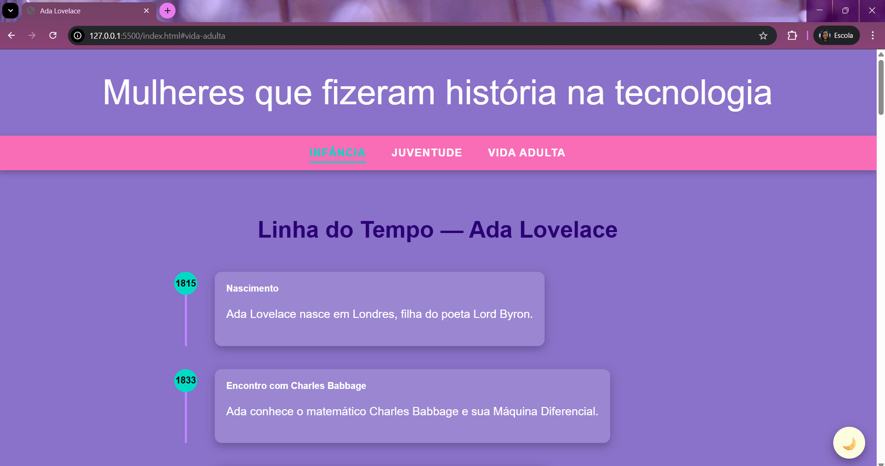
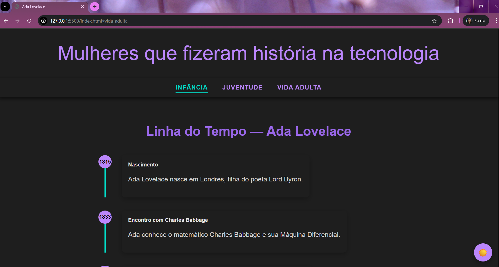

# Mulheres que fizeram história na tecnologia – Ada Lovelace

Este projeto é uma página web educativa dedicada a destacar mulheres que marcaram a história da tecnologia, com foco especial em **Ada Lovelace**, considerada a primeira programadora da história.

O objetivo do projeto é unir **conteúdo histórico**, **estrutura semântica em HTML**, **estilização com CSS** e **interatividade básica com JavaScript**, servindo também como parte do meu **portfólio de estudos na área de tecnologia**.

---

## Objetivo do Projeto

- Praticar os fundamentos de **HTML5, CSS3 e JavaScript**
- Desenvolver uma página web estruturada, acessível e organizada
- Aplicar controle de versão utilizando **Git e GitHub**
- Publicar o projeto como site estático utilizando **GitHub Pages**
- Valorizar a representatividade feminina na história da computação

---

## Tecnologias Utilizadas

- **HTML5**  
  Estrutura semântica do conteúdo

- **CSS3**  
  Estilização da página, cores, layout e tipografia

- **JavaScript (Vanilla)**  
  Validação simples de formulário e interação com o usuário

- **Git & GitHub**  
  Controle de versão e hospedagem do código

- **Visual Studio Code**  
  Editor de código utilizado no desenvolvimento

---

## Estrutura do Projeto

```text
site-ada/
│
├── index.html
├── css/
│   └── style.css
├── js/
│   └── script.js
├── img/
│   └── (imagens do projeto)
└── README.md
```

### Funcionalidades

Navegação interna por seções (Infância, Juventude e Vida Adulta)

Layout centralizado e responsivo

Estilização personalizada com classes CSS

Links externos para outras mulheres importantes da tecnologia

Formulário com validação em JavaScript

Publicação do site via GitHub Pages

### Como Executar o Projeto

### Opção 1 – Executar localmente

- Clone ou faça o download do repositório
- Abra a pasta do projeto
- Clique duas vezes no arquivo index.html

O site será aberto no navegador

### Opção 2 – Acessar online

O projeto pode ser acessado diretamente pelo GitHub Pages:

[GitHub Pages](https://biagfialho.github.io/Pagina-Ada-Lovelace/)

## 📸 Preview do Projeto





### Aprendizados

- Durante o desenvolvimento deste projeto, foram consolidados conhecimentos importantes como:

- Organização de projetos front-end

- Boas práticas de HTML semântico

- Separação de responsabilidades (HTML, CSS e JS)

- Versionamento de código com Git

- Integração entre VS Code e GitHub

- Resolução de conflitos e sincronização de repositórios

### Autora

Bianca
[Linkedin](https://www.linkedin.com/in/biancafialhoo)

### Observação Final

Este projeto faz parte da minha jornada de aprendizado contínuo em tecnologia.
Sugestões e feedbacks são sempre bem-vindos! 
